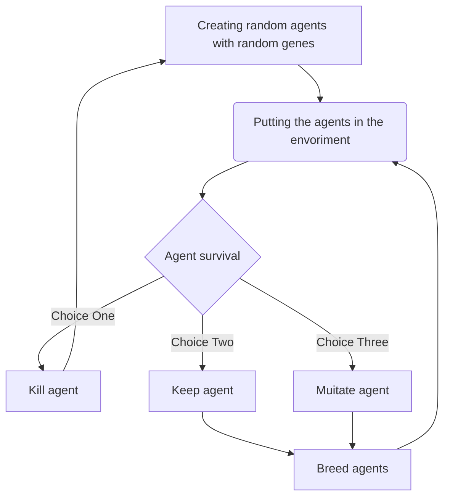

# Dino-simulator
Small simulation of getting the best dino height in the environment, if the dino is too short it dies and if it requires too much food it dies.

**install repository and run `Simulation.py`**

# Diagram

* Choice 1 = Agent doesn't have the required genomes to survive the simulation/environment
* Choice 2 = Agent barely has the required genomes to survive the simulation/environment
* Choice 3 = Agent fits in great for the required genomes to survive the simulation/environment
